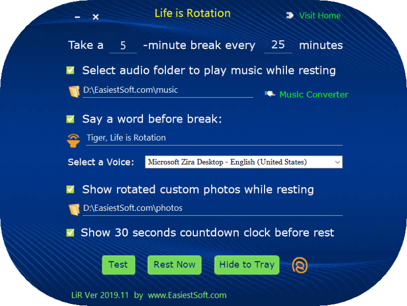
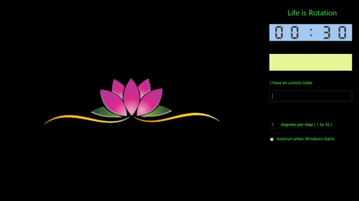
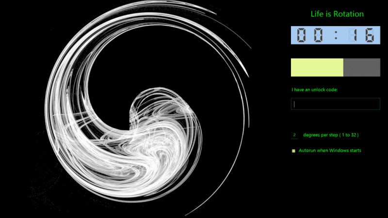
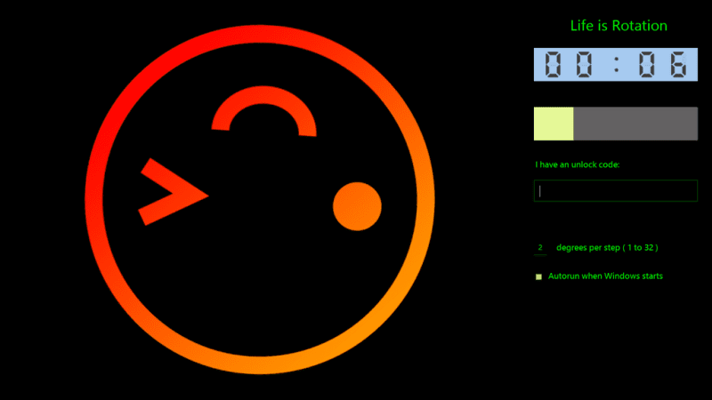

LiR Pomodoro Timer for Windows
=========================

[Download LiR Pomodoro Timer(for Windows 64/32 bit)](https://www.easiestsoft.com/win/a-life-is-rotation-timer/)
---------

Why develop another pomodoro timer
---------------

LiR = Life is Rotation

**LiR is a free portable software**. You can view the functions of the software from its interface, let me now talk about some other topics

Basically, I'm a philosopher (I want to be one of the greatest philosophers), not a programmer, but I still want to develop a rest reminder myself. Why? Because none of the other reminders please me!

- Rest is more important than work

  Every one knows that work is important, money is important, and what I want to say is that rest is more important

  I'm not a professional programmer, but I like programming because programming gives me more freedom than anything else. I think modern philosophers should learn programming

  Since learning programming, the first software I want to develop is a break reminder, because I also realize that humans may not have much free will

- Basically, humans may not have much free will

  You thoughts and behaviors are not so different from those of other people in the world. Your environment and your past experience determine how your think and behave

  Rest reminders should force users to take regular breaks, such as locking the screen during breaks to prevent users from staying in front of computer

  LiR has a built-in password to unlock the locked screen, but I hope you better not ask me for this

- Life is Rotation

  Many people say that life lies in motion, but I say: more accurately, **Life lies in Rotation**

  If you use LiR, you can see that some icons on the main interface are rotated, and the photo or picture on the full-screen window displayed at rest is also rotated

  Why **Life is rotation**, in the long run, I should write a book to clarify this topic. Philosophically, using LiR will make you a little bit luckier

Why you should use LiR tomato timer on Windows
-----------------

- Rest is more important than work, LiR forces you to take regular breaks
- Option to play audio during breaks so that when the audio stops, you know you should go back to work
- It's cool to say a custom word before the break
- It can show custom rotated photos during breaks, which is interesting
- LiR has beautiful software interface
- More importantly, LiR can bring you good luck, which is true

Technologies used in LiR development
------------

LiR was developed in a programming language with a syntax similar to Lua

LiR was developed under Windows 10

Full screen example 1:
-----------

Full screen example 2:
-----------

